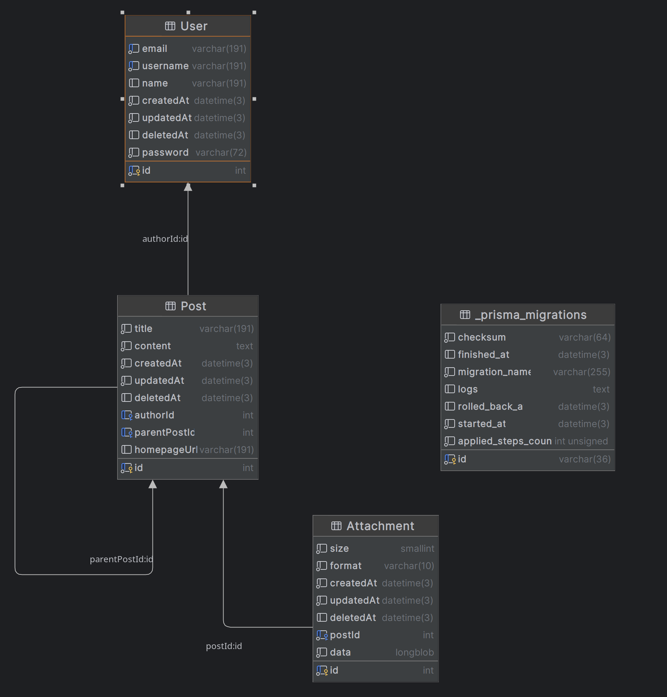

# Comments

## Database schema

Based on Prisma schema in `./prisma/schema.prisma`  
Dedicated `.sql` file is in `./database/generated.sql`

## Functionality

1. crud for user
2. crud for post (with pagination)
3. Jwt authentication (+ Guards to controllers)
4. I store Attachments in the same database
5. Validation of the requirements for attachments
6. Validation of html in content
7. Docker with docker-compose

I've tried to host on a free Amazon EC2 instance. However, it seems not to have enough resources to operate.